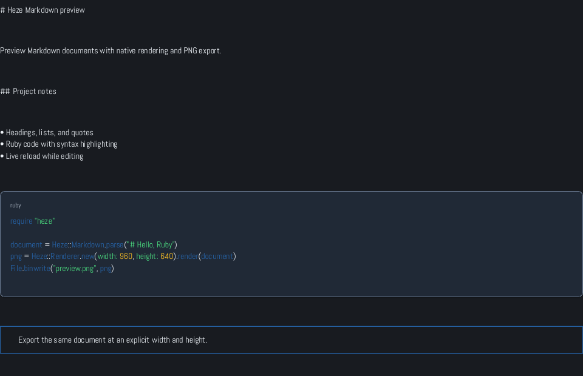

Heze previews Markdown documents and static SVG files through a native window or terminal backend. It also exports PNGs without opening a window.

## Install Heze

You need **Ruby 3.2 or newer**. Check your version, then install the gem:

```bash
ruby --version
gem install heze
```

For a source checkout, run `bundle install`, then use `bundle exec exe/heze` in place of `heze` in this guide.

Native previews require a graphical session:

| Platform | Requirements |
| --- | --- |
| macOS | A desktop session with Metal support |
| Linux | Wayland/EGL or X11/GLX graphics libraries and a running display session |
| Windows | 64-bit Ruby and Windows 10 graphics APIs |
| Headless export | No graphical session required |

## Preview your first document

1. Save the following text as `notes.md` in your editor.
2. Open a terminal in the same directory and run `heze notes.md`.
3. Keep your editor open beside the preview. Change a sentence and save the file; the preview reloads the document.

````markdown
# Project notes

Preview a document while editing it.

- Write a short outline
- Add a code example

```ruby
puts "Hello from Heze"
```

> Save the file to refresh the preview.
````



The screenshot shows the current renderer. Heze preserves the heading markers and list text, highlights fenced code, and frames quotes. Read [previewing documents](preview.md) for its Markdown limitations and directory browser.

## Save a PNG

Export the document at a chosen size:

```bash
heze notes.md --width 1200 --height 800 --export notes.png
```

This creates `notes.png` in the current directory and exits. The image captures one viewport; increase the height for longer documents. See [PNG export](export.md) for themes, repeated exports, and the Ruby API.

## If a window does not appear

Start Heze from an interactive terminal. Piped or redirected output produces a short path summary rather than opening a window. `--backend headless` also prints a summary; use `--export` to create an image.

If a native backend cannot open, Heze reports `native preview unavailable` and falls back to that summary. Try a [terminal preview](preview.md#choose-a-backend), or export a PNG. Use `--no-watch` to return immediately after the summary, or press Ctrl+C to stop a waiting watcher.

For `file not found`, check the path and quote filenames containing spaces. A directory must contain at least one lowercase `.md` file. For encoding errors, save the document as UTF-8; UTF-8 BOMs are accepted, and Menkar can decode other text encodings, including Windows-31J.

Continue with [previewing documents](preview.md), [PNG export](export.md), or [SVG files](svg.md).
